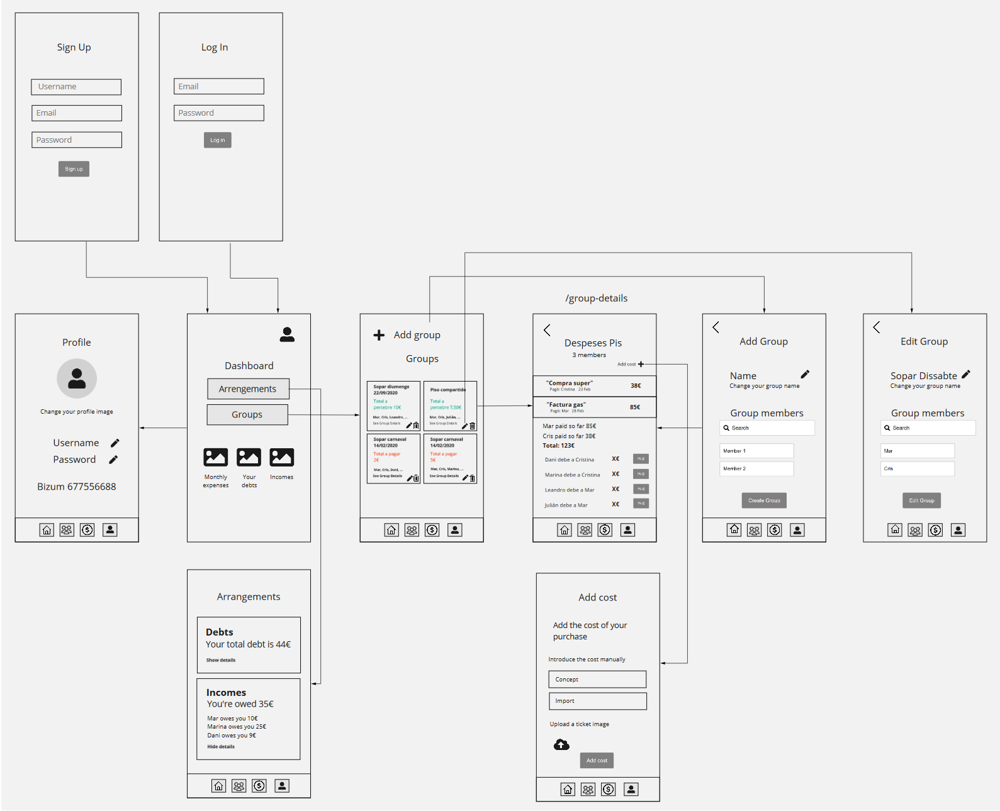

# Splitapp


## Description

Splitapp is an app to manage costs and expenses among mates. It will let you to keep track of all your costs (the receipts you have paid for) and your expenses (the proportional part of a cost your friends owe to you). Or, who knows, maybe you are the defaulter here. 

The costs can be introduced manually or by scanning a ticket. If you choose to scan a ticket, you will be able to select the imports you want to add among all of them.

An easy way to know who you owe money to or who owes you money. 

## User Stories

- **Signup:** As an anon I can sign up in the platform so that I can start using the app.

- **Login:** As a user I can login to the platform so that I can manage my expenses.

- **Logout:** As a user I can logout from the platform so no one else can use it.

- **View/edit Profile** As a user I can edit and check my profile and it will be visible for all my groups members.

- **Create/edit/delete group** As a user I can create groups to manage different expenses, edit and delete them.

- **Add/delete Costs** As a user I can add and delete the costs I payed to/from my groups lists.

- **Add/delete Expenses** As a user I can add and delete expenses to/from my lists.

- **Arrangements** As a user I can check all the debts I have and all my pending incomes.


## Backlog

- To improve the user profile by introducing a notification system using the Telegram's API.

- To add statistics in order to classify the user incomes and expenses by category.


# Client / Frontend

## React Router Routes (React App)

| Path                | Component    | Permissions             | Behavior                                                     |
| ------------------- | ------------ | ----------------------- | ------------------------------------------------------------ |
| `/`                 | Dashboard    | private`<PrivateRoute>` | Home page                                                    |
| `/signup`           | SignupPage   | anon only `<AnonRoute>` | Signup form, link to login, navigate to homepage after signup |
| `/login`            | LoginPage    | anon only `<AnonRoute>` | Login form, link to signup, navigate to homepage after login |
| /arrangements       | Arrangements | private`<PrivateRoute>` | Check incomes and expenses, navigate to the main pages       |
| /profile            | Profile      | private`<PrivateRoute>` | Check your profile, go to edit profile page and navigate to the main pages |
| /profile-edit/:id   | ProfileEdit  | private`<PrivateRoute>` | Edit your profile and navigate to the main pages             |
| /groups             | Groups       | private`<PrivateRoute>` | Check all the active groups, go to create group page, go to the detail page of this group and navigate to the main pages |
| /groups-edit/:id    | AddGroup     | private`<PrivateRoute>` | Add members to a group, modify the name and insert an image and navigate to the main pages |
| /groups-addCost/:id | AddCost      | private`<PrivateRoute>` | Add a cost manually or by uploading a ticket image, come back to group details and navigate to the main pages |
| /groups/:id         | GroupDetails | private`<PrivateRoute>` | Check the details of your groups, delete the group, add costs, calculate the expenses of each member, go back to groups list and navigate to the main pages |

## Components

- App
- Signup
- Login
- Home
- Dasboard
- Groups
- GroupDetails
- AddGroup
- AddCosts
- Arrangements
- Checkbox
- EachExpense
- EachGroup
- Navbar
- Search
- PrivateRoute
- AnonRoute


# Server / Backend

## Models

User model

```
 {
      username: {type: String, required: true},
      email: {type: String, required: true, unique: true},
      password: {type: String, required: true},
      image: {type: String, default: ""},
      phone: {type: Number},
    },
    {
      timestamps: {
        createdAt: "created_at",
        updatedAt: "updated_at",
      },
    }
```

Group model

```
{
        name: {type: String},
        image: {type: String, default: ""},
        members: [{type: Schema.Types.ObjectId, ref: 'User'}],
        costs: [{type: Schema.Types.ObjectId, ref: 'Cost'}],
    },
    {
      timestamps: {
        createdAt: "created_at",
        updatedAt: "updated_at",
      },
    }
```

Cost model

```
{
        concept: {type: String, required: true},
        costImport: {type: Number, required: true},
        ticket: {type: String},
        group: {type: Schema.Types.ObjectId, ref: "Group"},
        buyer: {type: Schema.Types.ObjectId, ref: "User"},
        date: { type:Date, default: Date.now },
    },
    {
      timestamps: {
        createdAt: "created_at",
        updatedAt: "updated_at",
      },
    }
```

Expense model

```
 {
        expenseImport: {type: Number},
        payed: {type: Boolean, default: false},
        group: {type: Schema.Types.ObjectId, ref: "Group"},
        payer: {type: Schema.Types.ObjectId, ref: "User"},
        beneficiary: {type: Schema.Types.ObjectId, ref: "User"}
    },
    {
      timestamps: {
        createdAt: "created_at",
        updatedAt: "updated_at",
      },
    }
```


## API Endpoints (backend routes)

| HTTP Method | URL                        | Request Body                                                 | Success status | Error Status | Description                                                  |
| ----------- | -------------------------- | ------------------------------------------------------------ | -------------- | ------------ | ------------------------------------------------------------ |
| POST        | `/auth/signup`             | {username, email, password}                                  | 201            | 404          | Checks if fields not empty (422) and user not exists (409), then create user with encrypted password, and store user in session |
| POST        | `/auth/login`              | {email, password}                                            | 200            | 401          | Checks if fields not empty (422), if user exists (404), and if password matches (404), then stores user in session |
| POST        | `/auth/logout`             | (empty)                                                      | 204            | 400          | Logs out the user                                            |
| GET         | `/profile/:id`             | Saved session                                                | 200            | 404          | Check if user is logged in and return profile page           |
| PUT         | `/profile/edit/:id`        | {username, email, image, phone}                              | 200            | 400          | Update user profile                                          |
| POST        | `group/add`                | {name, members, image, users id array}                       | 200            | 400          | Create a group to share expenses with                        |
| PUT         | `group/edit/:id`           | {name, members, image, users id array}                       | 200            | 400          | Edit an existing group                                       |
| DELETE      | `/group/delete/:id`        | {id}                                                         | 200            | 400          | Delete an existing group                                     |
| GET         | `/group`                   | {}                                                           |                | 400          | Show all the existing groups                                 |
| GET         | `/group/group-details/:id` | {id}                                                         |                | 400          | View group details page                                      |
| POST        | `/cost/add`                | {concept, description, import, image, user id (buyer), group id, array users id} | 200            | 400          | Introduce a cost                                             |
| DELETE      | `/cost/delete/:id`         | {id}                                                         | 200            | 400          | Delete an existing cost                                      |
| POST        | `/expense/create`          | {import, payed , cost id, user id, }                         | 200            | 400          | Set the expense for each group member                        |
| DELETE      | `/expense/delete/:id`      | {id}                                                         | 200            | 400          | Delete an existing expense                                   |
| GET         | /arrangements              |                                                              |                | 400          | Check all your debts and all your pending incomes            |


## Wireframes




## Links

### Trello

https://trello.com/b/fmtoOs4Z/organitzaci%C3%B3-projecte-3

### Git

https://github.com/cristinacastro/Project-3-server

https://github.com/cristinacastro/Project-3-client

https://project3ih.herokuapp.com/


### Slides

https://docs.google.com/presentation/d/1HTo5i0nOMyy3eusWxx-fVmbrW6Rfadvh/edit#slide=id.gad0d515f45_0_529

